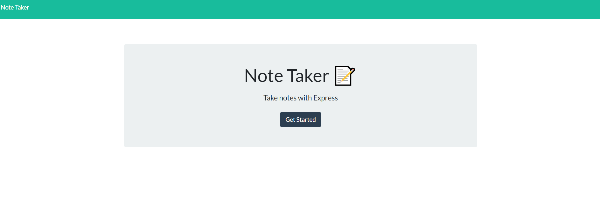
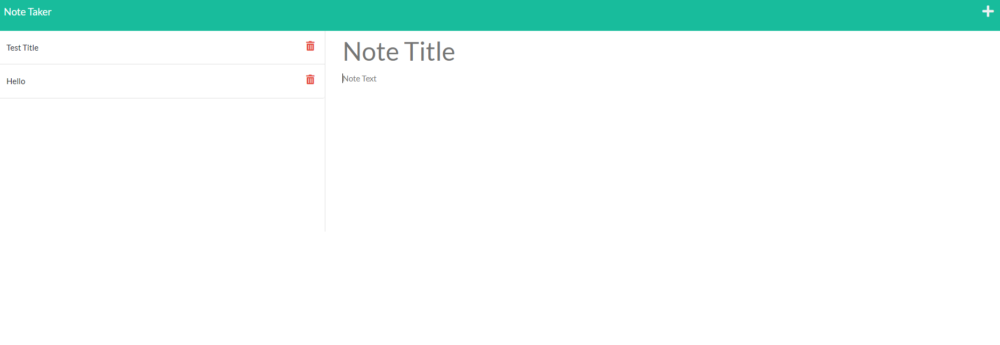

# Note_Taker_Express-11

## Description:

By modifying starter code, I create an application called Note Taker that can be used to write and save notes. This application will use an Express.js back end and will save and retrieve note data from a JSON file.
The application’s front end has already been created & I worked on the back end, connect the two, and then deploy the entire application to Heroku.

## Criteria:

* By opening the Note Taker, you're presented with a landing page with a link to a notes page

* By clicking on the link to the notes page, you're presented with a page with existing notes listed in the left-hand column, plus empty fields to enter a new note title and the note’s text in the right-hand column

* By entering a new note title and the note’s text, a Save icon appears in the navigation at the top of the page, by clicking on that, the new note is saved and appears in the left-hand column with the other existing notes

* By clicking on an existing note in the list in the left-hand column, that note appears in the right-hand column

* By clicking on the Write icon in the navigation at the top of the page, you're presented with empty fields to enter a new note title and the note’s text in the right-hand column

## Link:

* [Heroku Deployed Page](https://note-taker-gj.herokuapp.com/)

## Site Preview:

